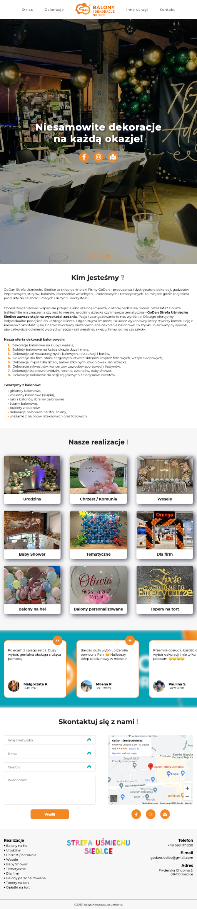
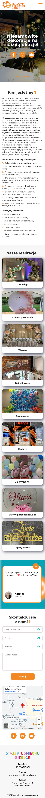

# decoration-company-website

The repository contains the source code of a site written from scratch for a company that creates decorations for various occasions. The purpose of the site was to showcase the company's offerings to potential customers and encourage them to use their services. The design was customized for every possible screen, and after the client approved the project, it was hosted and published online.

### Link to website:
- https://godansiedlce.pl/

### Technologies used:
- HTML
- CSS
- JavaScript
- PHP

### Desktop page view

### Tablet page view

### Mobile page view

